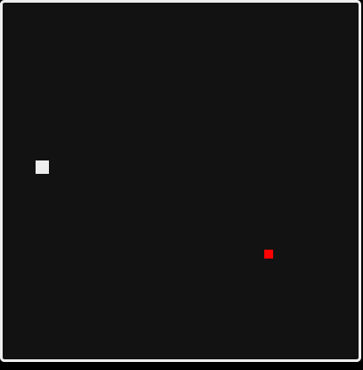

# jQuery Snake Game

## Front End Application made with jQuery

## Introduction

This is my attempt to make a snake game after completing this [Udemy Course](https://github.com/D-Whipp/jQueryBtoA). All the code is done by me. The only things I looked up were specific methods such as styling with jQuery.

## This game is a work in progress

This repository was originally kept in another repository: [jQuery BtoA](https://github.com/D-Whipp/jQueryBtoA).\
[jQuery BtoA](https://github.com/D-Whipp/jQueryBtoA) follows a Udemy Course I completed. Once complete, I began developing this snake game to see the impact that course had on my understanding of jQuery.

### Currently I've accomplished

- Starting the game with the Snake in the top left corner
- Placing the food in a random location at the start of the game
- Regenerating the food once the snake comes into contact with the food

### What I need to figure out

- How to add the "tail logic" to the snake everytime the snake eat's the food
- Having the tail behave appropriately while it follows the Snake's head

## About Me

Hello! My name is David.\
Email me at dwhipp88@gmail.com.\
Or visit my [LinkedIn](https://www.linkedin.com/in/david-w-079841213/)\
If you're interested in seeing more of my work then check out my [portfolio](http://mighty-brook-32674.herokuapp.com/) or you can view my [github](https://github.com/D-Whipp).

## Badges

I'm not adding badges until I complete the game. I have to earn them 😀.
